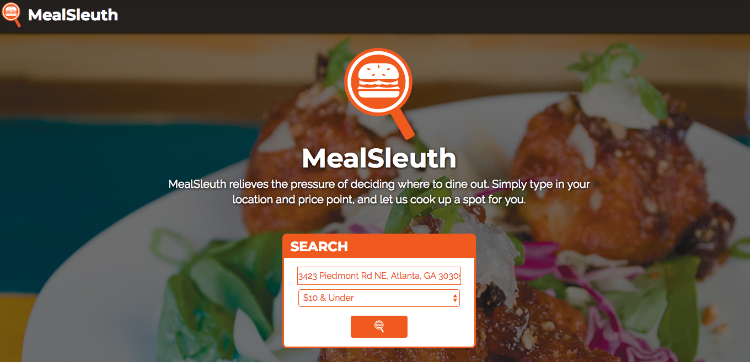
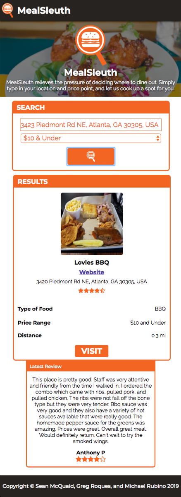

# MealSleuth


## Contents
    * Description
    * Features
    * Technologies
    * Challenges and Solutions
    * MVP
    * Stretch Goals
    * Authors
    * Screenshots

## Description
This project is a front-end only application designed to search for certain restaurants based on user input for location and price range. The application returns a result that matches the user's input and renders it within the browser. The user can then get directions to the resulting location via Google Maps.

### Features
* Finds results using location and price range as criteria
* Provides restaurant information for any search results given
    * A randomly selected photo from the resulting restaurant's photo array inside of the JSON object is displayed on the page next to the restaurant's name and addresses
    * Overall rating, price range and cuisine type are also displayed on the page
* Distance Calculation
    * The application asks the user to share their current location. If allowed, the location input is populated with the user's location, which can then be changed to another address by the user if they so choose.
    * The address is put into a URL that is inputted into a JSON request. From there the latitude and longitude are extracted from the results, which are then plugged into a call to Google Nearby Places. 
    * This call returns an array of results, which is then parsed for a single result to render in the DOM based on a randomization function. The latitude and longitude of the rendered result are used to determine the distance between the starting and ending points.
* Provide user reviews of search results
    * The most recent review for a given restaurant is displayed either to the side of or below the result's main container.

## Technologies
* HTML/CSS/JavaScript
* jQuery
* Google Maps/Places API
* Zomato API

## Challenges and Solutions
* Distance Calculation
    At one point we had tried implementing the Haversine formula in order to calculate the distance between two pairs of coordinates, but using that formula would only calculate the distance in terms of a straight line between the two points. Given that we needed to calculate the distance in terms of actual traversable terrain (i.e. roads, sidewalks, etc.), this formula would not work for our purposes.

    In order to better calculate traversable distance, we used Google Maps API's distance matrix to return that actual distance in miles from origin to destination.

    ```
    let directionsURL;
    $.getJSON(googleUrl,(searchData)=>{
        const nearbySearchLength = (searchData.results).length;
        const nearbySearchNumber = (Math.floor(Math.random() * Math.floor(nearbySearchLength)));
        const placeId = searchData.results[nearbySearchNumber].place_id;
        const placeLat = searchData.results[nearbySearchNumber].geometry.location.lat;
        const placeLon = searchData.results[nearbySearchNumber].geometry.location.lng;
        const placeLocation = `${placeLat},${placeLon}`;
        const distanceUrl = `https://maps.googleapis.com/maps/api/distancematrix/json?units=imperial&origins=${searchCoordinates}&destinations=${placeLocation}&language=${language}&key=${distanceKey}`;
        directionsURL =  `https://www.google.com/maps/dir/${searchCoordinates}/${placeLocation}/`;
        $(".visit-link").attr("href", directionsURL);
        ...
    });
    ```
* Dealing with "undefined" Values
    We created a set of conditionals that checked the JSON object for the parameters needed to populate the results section. If the parameters did not exist (i.e. returned "undefined"), then the code would return a string indicating to the user that the information is currently available.

    ```
    let reviewsLength,reviewsNumber,reviewUserName,reviewRating,reviewText;
        if(searchDetails.result.reviews){
            reviewsLength = (searchDetails.result.reviews).length;
            reviewsNumber = (Math.floor(Math.random() * Math.floor(reviewsLength)));
            reviewUserName = searchDetails.result.reviews[reviewsNumber].author_name || '';
            $(".review-username").html(`${reviewUserName}`);
            reviewRating = searchDetails.result.reviews[reviewsNumber].rating;
            reviewRating = ratingConversion(reviewRating);
            $(".review-score").html(`${reviewRating}`);
            reviewText = searchDetails.result.reviews[reviewsNumber].text;
            $(".review-text").html(`${reviewText}`);
        } else{
            $(".review-username").html("None available");
            $(".review-score").html("None available");
            $(".review-text").html("None available");
        };

        let photoLength, photoNumber, photoRef, photoWidth, restPhotoUrl;
        if((searchDetails.result.photos)){
            photoLength = (searchDetails.result.photos).length;
            photoNumber = (Math.floor(Math.random() * Math.floor(photoLength)));
            photoRef = searchDetails.result.photos[photoNumber].photo_reference;
            photoWidth = searchDetails.result.photos[photoNumber].width
            restPhotoUrl = `${googlePlaceUrl}/photo?maxwidth=${photoWidth}&photoreference=${photoRef}&key=${placesKey}`
            $(".rest-pic").attr("src", `${restPhotoUrl}`);
        } else {
            $(".rest-pic").attr("src", "./images/placeholderimg.png");
        };
    ```

    We did this because our main code would continually break once the undefined values were passed into it. Once this issue was solved, the majority of return issues we were dealing with were taken care of.
* Finding Cuisine Type
    While the Google Maps API offers a wide breadth of information, it unfortunately does not specify cuisine For the purposes of keeping MealSleuth limited to being solely a front-end application, we called upon the Zomato API in order to find the type of cuisine associated with a restaurant.

    The key issue with this approach was that Zomato would have some locations under a different name than Google Maps. To account for this variation, we took the first word of every restaurant's name returned from Google and converted it to lowercase. Then we compared the converted string to the name retrieved from Zomato. If the two strings matched, then it would return the type of cuisine. With this change implemented, we went from an estimated 85-90% match rate on cuisine type to an estimated 95% match rate.

    ```
    const zomUrl = `https://developers.zomato.com/api/v2.1/search?lat=${searchLat}&lon=${searchLon}&sort=real_distance&apikey=${zomatoKey}&start=0&count=100`;
    $.getJSON(zomUrl,(zomData)=>{
        nearbyZomato = zomData.restaurants;     
        
        for(let k=0; k < nearbyZomato.length; k++){      
            const restNameFormat = (`${(restName.split(" ")).slice(0,1)}`).toLowerCase(); 
            let zomatoRestName = nearbyZomato[k].restaurant.name;
            let zomatoRestNameFormat = (`${(zomatoRestName.split(" ")).slice(0,1)}`).toLowerCase();

            if(zomatoRestNameFormat === restNameFormat){
                let cuisineOfRest = nearbyZomato[k].restaurant.cuisines.split(",", 1);
                $(".cuisine").html(cuisineOfRest);
                return;
                
            } else {
            $(".cuisine").html("Not available!");
            };
        };
    });
    ```

## MVP
* Create a basic front-end application that can search for the nearest restaurants from any given location.
* Requirements
    * Can use location and price range as search criteria
    * Returns information for restaurants from Google Maps/Places API & Zomato API
    * Returns latest review for restaurants
    * Page is fully responsively designed

## Stretch Goals
* Allow users to pull up directions to the result of their search using Google Maps.
    * Status: Completed
* Enable search by type of food.
    * Status: Incomplete

## Authors
* Sean McQuaid
    * Contributions:
        * Concept, Project Management, Google Places API Implementation, Zomato API Implementation, Responsive Design, Dealing with Undefined Values, Finding Cuisine Type
    * [GitHub Profile](https://github.com/seanmcquaid)
* Greg Roques
    * Contributions:
        * Desktop Wireframing, Background Design, Google Places API Implementation, Zomato API Implementation, Distance Calculation, Finding Cuisine Type
    * [GitHub Profile](https://github.com/GregRoques)
* Michael Rubino
    * Contributions:
        * Mobile Wireframing, Google Places API Implementation, Zomato API Implementation, Responsive Design, Finding Cuisine Type
    * [GitHub Profile](https://github.com/rubinoAM)

## Screenshots
* Search Results (Desktop)


* Search Results (Mobile)

